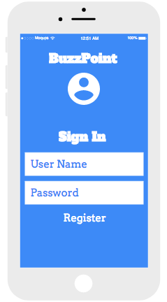
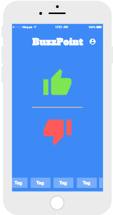
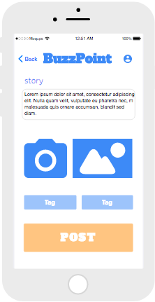
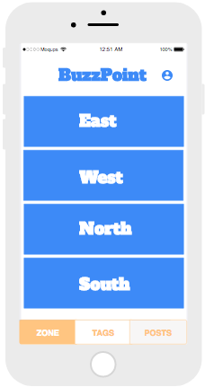
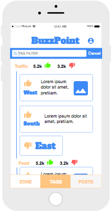
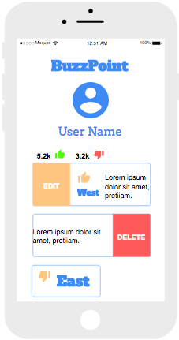
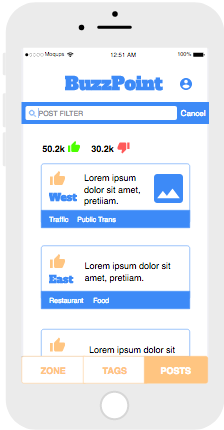

# BuzzPoint
BuzzPoint is an app that communicates exactly what is going on in real time in a city whether that be events, new restaurants, traffic etc. By capturing a user experience and correlating it with a tag and city zone, everyone can get be connected to opposite parts of the city at a given time. This form of communication will yield a more vivid picture of HOW a city is growing in real time. It will also be a helpful daily update for public transit choices, new art installations, restaurants, parks etc. The app was created to get user data and tell a story based on aggregate feedback from the population that will make solutions clearer as the city looks to expand and optimize its growth.

Technologies: 
 - Client consumes API using Express for routes and middleware 
 - Implements React Native for mobile capabilities and component based architecture
 - BuzzPoint uses Google Maps API reverse geocoding logic which converts geographic coordinates of the post into a human-readable address
 - Firebase storage is hosting images sent from camera and camera roll

# Moqups

